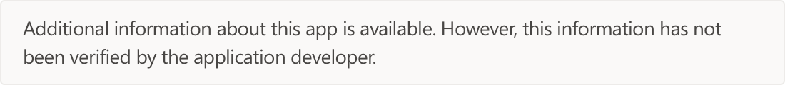

# Trello

* <a href="https://teams.microsoft.com/l/app/49e6f432-d79c-49e8-94f7-89b94f3672fd" target="_blank">View in Teams store</a>

::: zone pivot="general"

### General information

Information provided by Trello to Microsoft:

| **Information** | **Response** |
|:----------------|:-------------|
| App name | Trello |
| ID | 49e6f432-d79c-49e8-94f7-89b94f3672fd |
| Capabilities | Bot, Tab, Messaging Extension, Connector |
| Partner company name | Trello |
| URL of partner website | <https://trello.com> |
| URL of Privacy Policy | <https://trello.com/privacy> |
| URL of Terms of Use | <https://trello.com/legal> |

 [!INCLUDE [Corrections or suggestions contact information](./includes/corrections-or-suggestions.md)]

::: zone-end

::: zone pivot="mcas"

Information from the [Microsoft Cloud App Security](https://www.microsoft.com/en-us/enterprise-mobility-security/cloud-app-security) catalog:

<iframe height='1020' title='Microsoft Cloud App Security Information' src='https://3ca685143b5b46b4b0e5266dadf2e97c.codepen.website/#/dashboard/12114' frameborder='no'  style='width: 100%;'>

Open <a href="https://3ca685143b5b46b4b0e5266dadf2e97c.codepen.website/#/dashboard/12114" target="_blank">in a new tab</a>

[!INCLUDE [Corrections or suggestions contact information](./includes/corrections-or-suggestions.md)]

::: zone-end

::: zone pivot="csa"

### CSA STAR information

[Cloud Security Alliance](https://cloudsecurityalliance.org/about/) is a not-for-profit organization dedicated to defining and raising awareness of best practices to help ensure a secure cloud computing environment. The CSA maintains the [Security, Trust & Assurance Registry (STAR)](https://cloudsecurityalliance.org/star/), a free, publicly-accessible registry where cloud-based providers can publish information on security, privacy, and compliance practices. The STAR registry contains three levels of assurance: self-assessment, 3rd-party audit, and continuous monitoring. More information on assurance levels can be found [here](https://cloudsecurityalliance.org/star/#_overview).

> [!NOTE]
> This information is self-reported by Trello and directly submitted to and retrieved from CSA STAR. Microsoft is not responsible for the accuracy of this information.

<iframe height='798' scrolling='yes' title='Microsoft Teams App Information: CSA STAR' src='https://66eac45ba2a0418f9cfa290fcad4072b.codepen.website/#/details/495/Trello' frameborder='no' style='width: 100%;'>

[!INCLUDE [Corrections or suggestions contact information](./includes/corrections-or-suggestions.md)]

::: zone-end
