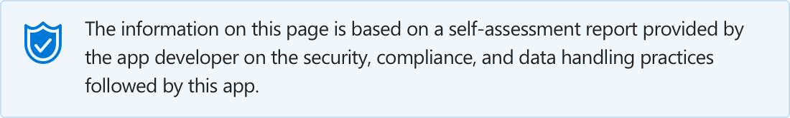

# Site24x7

Last updated by the developer on: —

* <a href="https://teams.microsoft.com/l/app/9ce8b7b7-4435-4edb-9c6f-205a9efe944d" target="_blank">View in Teams store</a>
* <a href="https://appsource.microsoft.com/en-us/product/office/WA104381289" target="_blank">View in AppSource</a>

::: zone pivot="general"

### General information

Information provided by Zoho Corporation Private Limited to Microsoft:

| **Information** | **Response** |
|:----------------|:-------------|
| App name | Site24x7 |
| ID | 9ce8b7b7-4435-4edb-9c6f-205a9efe944d |
| Capabilities | Bot, Tab, Connector |
| Partner company name | Zoho Corporation Private Limited |
| Physical address | ZOHO Corporation Pvt. Ltd., 4141 Hacienda Dr,, Pleasanton,CA 94588 |
| Contact information for this app | support@site24x7.com |
| URL of partner website | <https://www.site24x7.com/features.html> |
| URL of Teams application info page | <https://www.site24x7.com/help/admin/third-party-integration/microsoft-teams.html> |
| URL of Privacy Policy | <https://www.site24x7.com/privacypolicy.html> |
| URL of Terms of Use | <https://www.site24x7.com/terms.html> |
| Main telephone number | US: +1 408 352 9117; UK: +44 203 564 7893 |
| Description of available licensing options, if any | Site24x7 offers a package based pricing model for small IT teams, DevOps and also large enterprises. We offer these licensing plans: Free, Starter, Pro, Classic, Elite, Enterprise and MSP. There is a 30-days evaluation period and the subscription can be upgraded any time during this evaluation period. The evaluated packs will automatically downgrade to FREE account once the evaluation period is completed. |
| Licensing contact | support@site24x7.com |
| Licensing telephone number | US: +1 408 352 9117; UK: +44 203 564 7893 |

 [!INCLUDE [Corrections or suggestions contact information](./includes/corrections-or-suggestions.md)]

::: zone-end

::: zone pivot="data"

### How the app handles data

Information provided by Zoho Corporation Private Limited on how this app collects and stores organizational data, and what control an organization has over this data.

#### Data access using Microsoft Graph

This application does not use Microsoft Graph.

#### Data access via bots

If this app contains a bot or a messaging extension, it can access the roster (first name, last name, display name, email address) of any team member in a team or chat it's added to. Do this app make use of this capability?

>| **Access team/chat roster?**  | **Justification/Purpose** | **Is any of this data stored in app database(s)?** |
>|:--------------------------------|:---------------------|:--------------------------|
>|  |  |  |

#### Telemetry data

Does any organizational information, including EUII (end-user identifiable information) and OII (organizational identifiable information), appears in this application's telemetry/logs? If yes, describe what data is present and what controls/processes an organization has in place to archive and/or delete it. If no, describe the controls/processes in place to prevent EUII and OII from appearing in telemetry/logs.

>We don&#x27;t collect EUII / PII in telemetry and logs. We have scripts in place to look for and alert for fixing any such data being visible.

#### Storing and securing organizational data

Describe where/how is this application's data is stored and how access to it is controlled. Is it encrypted? Who can access it? How do you ensure that only authorized systems/individuals can access it? Examples: 2FA for all admins, Privileged Access Management (PMA), partitioning service admin accounts from Azure AD/corporate user accounts, protected IP ranges between systems, etc.

>Customer-centric data such as username, password, email address, mobile number, age, date of birth, address, job title, and credit card details are encrypted and stored in our database using the Advanced Encryption Standard (AES). Logical access to the servers is provided through an isolated & dedicated network and is highly secured and monitored. This network is protected with Firewall, 2- Factor Authentication and Kerberos Authentication Protocol. The accessing machines are securely hardened so that no data can be copied or transferred from the data center. Physical Access to the data centers are protected with Biometric+PIN. No visitors are allowed inside the dedicated cages of Zoho in the data centers. Only a very restricted number of employees have the access to the servers to carry out any emergency works.

#### Organizational controls for data stored by partner

Describe any capabilities an organization's administrators have to control their information residing in partner systems, e.g. deletion, retention, auditing, archiving, end-user policy, etc.

>Once a customer initiates termination of their Site24x7 account, Site24x7 will retain all this user's data for 30 days before erasing it completely from our US or EU or IN or CN data centers. Customers with requisite user permissions can manually log in to Site24x7's web client using their valid credentials and correct their inaccurate or incomplete personal data. Additionally, they can update any personal data using our documented RESTful APIs.

[!INCLUDE [Corrections or suggestions contact information](./includes/corrections-or-suggestions.md)]

::: zone-end

::: zone pivot="mcas"

Information from the [Microsoft Cloud App Security](https://www.microsoft.com/en-us/enterprise-mobility-security/cloud-app-security) catalog:

<iframe height='1020' title='Microsoft Cloud App Security Information' src='https://3ca685143b5b46b4b0e5266dadf2e97c.codepen.website/#/dashboard/19224' frameborder='no'  style='width: 100%;'></iframe>

<a href="https://3ca685143b5b46b4b0e5266dadf2e97c.codepen.website/#/dashboard/19224" target="_blank">View in a new tab</a>

[!INCLUDE [Corrections or suggestions contact information](./includes/corrections-or-suggestions.md)]

::: zone-end

